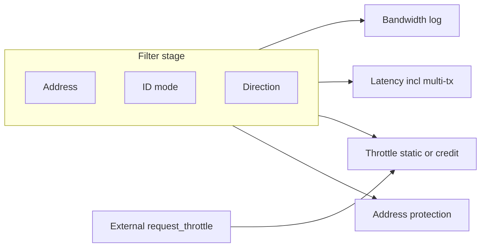

# AXI Performance Monitor IP — SoC 설계 의뢰서 (Design Request Specification)

**문서 목적**: 본 문서는 SoC IP 개발팀이 Verilog/SystemVerilog 기반 **AXI 성능 모니터 겸 대역폭 제어·주소 보호 IP**를 구현하기 위해 필요한 기능·동작·제약을 **최초 전달** 기준으로 정의한다.  
**독자**: SoC·IP 설계/검증/소프트웨어 담당자(본 IP를 처음 수령하는 경우를 가정).

**범위**: 본 문서가 이 IP에 대한 **기능·동작 요구의 단일 규범(norms) 기준**이다. **레지스터 비트·주소, 핀/포트 목록, 타이밍·전기 제약, SoC 연계 절차**는 IP 공급자가 **동반 제공하는 자료**에서 확정하되, 본 문서와 **모순 없이** 작성한다.

**단독 전달**: 본 패키지(한글·영문 의뢰서 마크다운, 블록 개요 그림)만으로 요구사항을 전달할 수 있게 작성하였으며, **다른 저장소의 마크다운이나 내부 문서를 읽을 필요는 없다.**

### 권장 전달 파일 구성

| 파일 | 설명 |
|------|------|
| `request_for_design_busmon.md` | 한글 본 사양(규범 텍스트·표). |
| `request_for_design_busmon_en.md` | 동일 내용 영문 사양. |
| `busmon_architecture_overview.png` | §10 블록 개요; 마크다운과 **동일 폴더**에 둘 것(상대 경로로 삽입). |

마크다운에서 Word 등으로 변환할 수 있다. §10.2의 Mermaid 도식은 뷰어에 따라 표시되지 않을 수 있으므로, **상세 동작·수치는 §4~§9 본문과 표**를 따른다.

---

## 0. 필수 vs 설계자 재량 표기

| 표기 | 의미 |
|------|------|
| **필수(MUST)** | 본 문서에 명시된 대로 구현·검증해야 함. |
| **권장(SHOULD)** | 일반적으로 그렇게 하는 것이 바람직하나, 동등 이상의 품질이면 대체 가능. |
| **재량(MAY)** | 구현 방식·마이크로아키텍처·세부 파라미터는 설계자 판단. 단, **필수 동작·AXI 규약 준수**는 깨지면 안 됨. |

---

## 1. 설계 목표 (필수)

- 상용 양산 가능한 수준의 완성도로 **AXI 성능 모니터 IP**를 제공한다.
- **대역폭/지연 로깅**, **대역폭 스로틀(여러 threshold 모드)**, **외부 스로틀 제어(External throttle control)**, **주소 보호(Address Protection)** 를 하나의 IP에서 제어·상태 레지스터로 구성할 수 있어야 한다.
- 고주파 동작을 고려한 파이프라인·타이밍 여유를 갖출 것.

---

## 2. 인터페이스 (필수)

### 2.1 AXI

1. **AXI Master Up / Master Down(또는 Slave Up / Master Down 등 명명은 재량)**  
   - Upstream과 Downstream은 **동일 데이터 폭**, **동일 클럭**을 사용한다.  
2. 기본 데이터 폭은 **256 bit**(설계 파라미터로 변경 가능은 **재량**, 기본값은 256).  
3. **Optional Register Slice**는 Up/Down 양측 또는 한쪽에 삽입 가능하도록 **파라미터**로 선택 가능해야 한다.

### 2.2 제어·상태 — APB

1. Control/Status는 **APB 32 bit** 슬레이브 인터페이스로 접근한다.  
2. `pstrb`는 **0xF 고정** 가정 가능.  
3. Master AXI와 **동일 클럭** 도메인.

### 2.3 인터럽트

- **인터럽트 출력 1개**(로깅 등 이벤트 공통 또는 마스킹 후 단일 라인 — 소스·마스크 비트 배치는 §8 및 **동반 제공되는 제어 레지스터 정의**에서 규정).

### 2.4 버스 외부 입력 — External throttle control

**필수**

- AXI 버스 포트와 **별도**인 **2 bit** 입력 포트 **`request_throttle[1:0]`** 를 둔다.  
- 입력 값은 **0~3**만 유효한 조합으로 정의한다(불필요한 비트 조합은 **재량**으로 무시하거나 0과 동일 처리 — 레지스터/문서에 명시).  
- 이 신호는 **AXI와 동일 클럭** 도메인으로 동작하는 것을 **권장**한다. 비동기 도메인이면 **재량**으로 동기화 단계를 두되, 메타스테이블리티 방지를 **필수**로 고려한다.

**재량**

- 포트 방향 표기(`input` 등) 및 모듈 최상단 핀 이름 접두어.

---

## 3. 기능별 Enable / Disable (필수)

Control 레지스터에 **기능 단위 enable/disable** 필드가 있어야 한다. 최소 분리 예시(이름·비트 배치는 **재량**):

- Bandwidth logging  
- Latency logging (단일 트랜잭션 / 멀티 트랜잭션 지연은 하위 enable 또는 공통 period 내 통계 선택 — §5.2)  
- Bandwidth throttling  
- **External throttle control** (`request_throttle` 입력 경로 — §6.3)  
- Address protection  

각 기능이 꺼졌을 때 **불필요한 클록 토글 감소** 등은 **권장**.

---

## 4. 트랜잭션 필터 (필수)

로깅·지연 측정·스로틀 **적용 범위** 판단에 공통으로 사용한다. 필터는 **논리 AND**로 조합한다: 주소·ID·방향 조건을 **모두** 만족하는 트랜잭션에만 해당 기능이 적용된다(각 기능 enable이 켜진 경우).

### 4.1 주소 필터

**필수**

- Control 레지스터로 **시작 주소 + 크기**(또는 시작/끝) 범위 내 트랜잭션만 추적하거나, **전체 주소 공간 추적**을 선택할 수 있어야 한다.

**재량**

- 주소 비교 방식( 정렬 제약, 상위 비트 마스크 등 )은 구현에 맞게 정의.

### 4.2 ID 필터

**필수**

- **AXI ID**(ARID/AWID 폭은 AXI 파라미터에 따름)에 대해 다음 모드를 레지스터로 선택 가능해야 한다.  
  1. **특정 ID만 추적(화이트리스트)** — 하나 이상의 ID 값 매칭(매칭 항목 수·비트 폭은 **디자인 파라미터**로 상한 정의).  
  2. **특정 ID 제외(블랙리스트)** — 지정 ID는 제외.  
  3. **전체 ID 추적**(필터 비활성과 동일 의미로 동작).

**재량**

- 화이트/블랙리스트 항목 수, 마스크·범위 비교 vs 완전 일치 목록.

### 4.3 DIRECTION 필터

**필수**

- 다음 중 레지스터로 선택:  
  - **Read만**  
  - **Write만**  
  - **Read + Write 모두**

**재량**

- “Write”에 AW만 포함할지 AW+W 채널 범위 구분 등 세부는 AXI 표준에 맞게 정의.

### 4.4 적용 범위 요약 (필수)

| 기능 | 필터 조합 |
|------|-----------|
| Bandwidth logging | 주소 + ID + DIRECTION |
| Latency logging (§5) | 동일 |
| Bandwidth throttling (§6) | 주소 + ID + DIRECTION (Latency logging과 동일 조합) |

---

## 5. Performance Logging

### 5.1 Bandwidth Logging

**요약(필수)**

1. **Period**: 사이클 수 또는 트랜잭션 수(AW+AR 핸드셰이크 등 정의는 레지스터 설명서에 명시) 중 선택. Enable 시 반복.  
2. **측정**: `AxSIZE × burst length` 등으로 바이트 산출; Write/Read 각각 누적; Period 종료 시 FIFO 저장.  
3. **FIFO**: Depth는 parameter; **Even/Odd** 두 뱅크; **N** period마다 저장 뱅크 전환(`N`은 depth 미만, Control로 설정).  
4. **인터럽트**: N period마다 레벨 인터럽트 가능, interrupt enable로 마스크.  
5. **상태**: 현재 Even/Odd 쓰기 대상, 마지막 인터럽트가 어느 FIFO 저장 이후인지.  
6. **필터**: §4 조합으로 카운트 대상 결정.

**재량**

- FIFO 구현(메모리 타입), 메타데이터 필드.

---

### 5.2 Latency Logging

#### 5.2.1 Period 및 평균 저장

**필수**

- Period는 Bandwidth logging과 **동일 레지스터** 사용.  
- **단일 트랜잭션** 관점의 지연은 Period마다 **평균**만 저장: 누적 합 / 트랜잭션 수.  
- **Write latency**: AW 핸드셰이크 완료 후 **B 채널 최초 수락**까지 사이클.  
- **Read latency**:  
  - AR 이후 **첫 RVALID**까지  
  - AR 이후 **마지막 RLAST & RVALID**까지 (두 값 각각 통계).  
- FIFO Even/Odd, N 주기 전환: Bandwidth와 동일 정책.

**재량**

- 내부 구조(예: ID별 대기 큐)는 구현에 맞게 선택한다.

#### 5.2.2 Read / Write Multi-Transaction Latency

**목적**: Outstanding 트랜잭션이 겹칠 때 **“연속 구간”의 종단간 지연**과 **누적 바이트**를 로깅 구조(Period/FIFO 정책)에 맞춰 저장한다.

**필수 — Read 멀티 트랜잭션 레이턴시**

1. **구간 시작**: 필터를 통과하는 Read 트랜잭션에 대해, **현재 Outstanding Read 트랜잭션이 없을 때**, **ARVALID & ARREADY**가 성립한 시점에서 **레이턴시 카운터 시작**.  
2. **구간 종료**: 해당 구간에 속하는 **마지막 Read 트랜잭션**에 대해 **RLAST & RVALID & RREADY**가 성립한 시점에서 **카운터 종료**.  
3. **저장**: 종료 시(또는 Period 경계에서의 집계 방식 — 아래 §5.2.3) **바이트 수**와 **Period(사이클) 수**를 **저장 방식(FIFO / 평균 등)에 따라** §5.1·§5.2.1과 동일한 **Even/Odd FIFO 체계**에 맞게 저장 가능해야 한다.  
4. **Outstanding이 이미 있는 상태**에서 새 Read가 시작되면: **이미 동작 중인 멀티 트랜잭션 레이턴시 카운터는 리셋하지 않고**, **바이트 수만 누적 증가**한다(동일 구간으로 간주).

**필수 — Write 멀티 트랜잭션 레이턴시**

- Read와 **동일한 정책**으로 정의한다. 구체적으로는 Write 경로에서 “구간 시작”은 Outstanding Write가 없을 때의 **AW (또는 규약에 맞는 첫 유효 요청 시점)**, “구간 종료”는 해당 구간 마지막 Write에 대한 **최종 응답(BVALID & BREADY)** 으로 한다.  
- 구간 중 추가 Write는 **카운터 리셋 없이 바이트만 가산**.

**재량**

- Write 멀티 구간의 바이트 산출이 AW 기준만인지 AW+W 데이터까지 포함하는지의 세부(단, 문서 전체의 바이트 정의와 **일관**되어야 함).  
- 멀티 트랜잭션 통계를 Period **평균**으로 넣을지, **샘플 단위 FIFO**에 넣을지 — 레지스터 맵에 명시.

#### 5.2.3 멀티 트랜잭션 통계와 Period의 관계 (필수·일부 재량)

**필수**

- 단일/멀티 트랜잭션 지연 통계는 모두 **§4 필터**를 통과한 트랜잭션만 포함.  
- Bandwidth/Latency와 **동일한 Period 타임베이스**를 사용할 수 있어야 한다.

**재량**

- 한 Period 안에서 여러 멀티 구간이 완료될 때 **평균·합·최대** 중 무엇을 저장할지는 성능 지표 정의에 따라 레지스터 맵에 확정.

---

## 6. Bandwidth Throttling

### 6.1 공통

**필수**

- 로깅용 Period와 **별도**로 `period_throttle`(명칭 재량) 등 주기 레지스터를 둔다.  
- 스로틀 대상 구간의 바이트 집계 방식은 로깅과 **동일한 바이트 산출 규칙**을 따른다.  
- **적용 범위**: §4 **주소 + ID + DIRECTION** 필터를 만족하는 트랜잭션에만 스로틀 동작.  
- 지연 삽입으로 대역폭을 제한한다.

**재량**

- 슬라이딩 윈도우 vs 고정 윈도우 등 집계 구현.

---

### 6.2 Threshold 동작 방식 옵션 (필수)

레지스터로 **동적 선택** 가능해야 한다.

#### 6.2.1 Static threshold

**필수**

- `period_throttle` 주기마다 집계한 바이트 합이 **설정 threshold**를 초과하면, AW/AR(및 §6.4) 채널에서 **ready 또는 상류 valid에 대한 수락 타이밍**을 지연하여 대역폭을 낮춘다.  
- AW와 AR에 서로 **다른 delay 값**을 설정 가능.

#### 6.2.2 Credit 방식 threshold

**필수 개념**

- **credit_period**: 로깅/스태틱 period와 **독립**인 주기. 레지스터로 설정.  
- 매 `credit_period`마다 **number_of_credit**(레지스터 동적 설정)만큼 크레딧이 **추가**되고 **누적**된다.  
- 누적값은 **상한**(레지스터 또는 파라미터로 동적 설정 가능)을 넘지 않도록 클램프.  
- 트랜잭션 **요청이 채널에서 수락될 때**(AXI에서 **해당 채널의 VALID & READY** 성립 시점으로 정의; 레지스터 문서에 채널별로 명시) 크레딧을 차감한다.  
- 차감량 = **요청 바이트**를 `credit_divider`만큼 **논리 시프트(우측)** 하여 얻는 값 — 즉 **bytes / 2^credit_divider** 의 정수 나눗셈(바닥, floor)에 상응하는 정수(bytes는 해당 트랜잭션 전송 바이트 수).  
- 차감 결과가 **0 미만이 되지 않도록** 한다(부족하면 §6.2.3).  
- **Read용 크레딧**과 **Write용 크레딧**을 **분리**하여 유지·차감한다.

**재량**

- 크레딧 단위 정수 비트 폭, 동시에 여러 트랜잭션 차감 순서.

#### 6.2.3 크레딧 부족 시 지연 (필수)

**필수**

- 차감 가능한 크레딧이 없으면 **트랜잭션 수락을 지연**시켜 대역폭을 제한한다.  
- Read 경로와 Write 경로에 대해 **독립적으로** 적용(분리된 크레딧과 일치).

---

### 6.3 External throttle control

AXI 버스가 아닌 **별도 핀**으로 들어오는 스로틀 지시를 받아, 내부 threshold 스로틀(§6.2)과 **독립인 지연 레지스터**로 **요청(request) 경로**에 삽입 지연을 가한다.

#### 6.3.1 입력 및 의미 (필수)

**필수**

- 포트 **`request_throttle[1:0]`** (§2.4).  
- **`request_throttle == 0`**: 이 기능이 enable된 경우에도 **이 입력에 의한 추가 지연은 없음**(no throttle by this selector).  
- **`request_throttle == 1`, `2`, `3`**: 각각 **서로 다른 지연량**이 **request 신호** 수락 경로에 적용된다. 지연량은 **레지스터로 설정**하며, **§6.2·§6.4에서 사용하는 AW/AR/W delay 레지스터·크레딧 관련 설정과는 별개의 레지스터**여야 한다(필수). 즉 *외부 선택값 1·2·3에 대응하는 delay 세트*는 **전용 레지스터 3개**(또는 동등한 분리된 저장소).  
- 본 기능의 **동작 enable/disable**은 **APB Control 레지스터로 동적 설정** 가능해야 한다(필수). enable이 꺼지면 `request_throttle` 입력은 **무시**되어도 된다(SHOULD: 문서화).

**재량**

- “request 신호”의 구체적 범위: 일반적으로 **AR·AW 주소 단계**의 수락(VALID/READY) 타이밍에 삽입되는 지연을 의미한다. **W·R 응답**까지 확장할지는 **재량**이나, 적용 채널은 레지스터 맵에 **명시**할 것.  
- 값 1·2·3 각각에 지연을 **한 레지스터에 인코딩**할지 **3개 독립 레지스터**로 둘지는 **재량**.

#### 6.3.2 내부 Bandwidth throttling과의 관계 (필수·재량)

**필수**

- External throttle과 §6.2 내부 스로틀이 **동시에** 활성일 때, 합성 지연이 AXI **프로토콜·데드락 없이** 동작해야 한다.

**재량**

- 지연의 **합산·최대값 선택·우선순위** 등 결합 규칙은 구현·레지스터 맵에 명시.

#### 6.3.3 적용 범위 (재량)

- §4 주소/ID/DIRECTION 필터를 외부 스로틀에도 적용할지 여부는 **재량**. 적용 시에는 레지스터로 선택 가능하게 할지는 **재량**. 미명시 시 **전역(모든 트랜잭션)** 에 적용하는 구현도 허용된다.

---

### 6.4 Write 경로 — WREADY 지연

**필수**

- 스로틀이 Write 데이터 경로에 미치는 영향으로, **WREADY 지연**을 추가할 수 있어야 한다.  
- 지연 **크기(사이클 또는 유사)** 는 **별도 레지스터**로 설정 가능.  
- Static/Credit 모드와의 조합 규칙(예: 크레딧 부족 시에만 WREADY 가산 등)은 **레지스터 맵에 명시**하고, AXI **W 채널 규약 위반 없이** 동작해야 한다.

**재량**

- AW 지연과 W 지연의 우선순위·합산 방식.

---

### 6.5 모드 선택 및 레지스터 (필수)

**필수**

- §6.2.1과 §6.2.2 중 **한 모드**를 런타임에 선택.  
- 선택에 따라 의미 없는 레지스터는 무시되어도 됨(SHOULD: 문서화).

---

## 7. Address Protection

Bandwidth throttle·latency log와 **별도로 enable 가능한** 기능으로 둔다.

### 7.1 보호 영역

**필수**

- **(base address, end address)** 쌍으로 허용 영역을 정의한다. 쌍의 **최대 개수**는 **디자인 파라미터**.  
- 각 쌍마다 **유효(valid)** 를 동적으로 켜고 끌 수 있어야 한다.  
- 트랜잭션 주소가 **어느 유효한 쌍에도 속하지 않으면** “보호 위반”으로 처리한다(주소 비교는 ARADDR/AWADDR 기준; 세부 **재량**).

### 7.2 Graceful ignore 동작

**필수 — Read**

- 보호 위반 Read 요청에 대해 **에러 로그 레지스터**에 **AXID**, **ARADDR**를 남긴다.  
- **AXI 프로토콜 타이밍이 깨지지 않도록** 하류·상류와의 핸드셰이크를 완결해야 한다.  
- 비보호 주소로의 실제 접근을 어떻게 막을지(예: 하류로 AR 미전달 + 로컬 에러 응답 생성 등)는 **재량**이나, **데드락 없음·READY/VALID 규약 준수**는 **필수**.

**필수 — Write**

- 보호 위반 Write에 대해 에러 로그에 필요한 정보를 남긴다(최소 **AWADDR**, **AWID** 권장).  
- 하류로 나가는 Write 데이터 경로에서 **WSTRB를 전부 0**으로 만들어 전달한다(사이클 정렬·패킹은 **재량**, **프로토콜 유지 필수**).

### 7.3 에러 로그 레지스터 형식 (필수)

각 에러 소스(또는 공통) 레지스터에 다음 의미를 갖는 필드를 둔다.

- **valid**: 에러 이벤트 표시.  
- **multi**: 배타적으로 다음을 표현:  
  - `valid=1`, `multi=0`: **1회** 발생.  
  - `valid=1`, `multi=N` (N>0): **N회** 발생 누적(단, **multi 비트 폭으로 표현 가능한 상한**까지만 증가; 초과 시 **포화** 또는 **오버플로 플래그** 중 하나는 레지스터 맵에 명시 — **재량** 중 하나 선택 후 문서화).

**필수**

- 에러 로그는 이 IP 내부의 **APB CSR 슬레이브** 접근으로 **Write-one-to-clear(W1C)** 하여 클리어 가능해야 한다.

**재량**

- Read/Write 에러를 분리한 레지스터 파일 vs 통합.

---

## 8. 인터럽트·상태 (필수 요약)

- 인터럽트 **1개** 라인.  
- 로깅 FIFO 이벤트, address protection 에러 등은 **마스크 레지스터**로 묶을 수 있음(**재량**, 단 요구 기능은 소프트웨어에서 구별 가능해야 함).

---

## 9. 검증 (필수)

- 충분한 **assertion(SVA 등)** 으로 AXI 규약·본 문서의 카운터 경계 조건을 검증한다.

---

## 10. 구조 개요도

### 10.1 블록 개요

### 10.2 필터 → 기능 적용 (참고 Mermaid)

---

## 11. 구현 산출물 (권장)

IP 공급자는 구현과 함께 다음을 제공하는 것이 **권장**된다(디렉터리 구조·이름은 **재량**).

- **RTL 소스**: 합성·시뮬레이션 가능한 Verilog/SystemVerilog.  
- **사용자 문서**: 본 의뢰서와 일치하는 **제어 레지스터 설명**(비트 의미, 주소, 리셋 값), 클럭/리셋·파라미터 설명.  
- **검증 자료**: SVA 등 assertion, 테스트플랜 또는 검증 요약.

---

## 부록 A. 용어·약어·AXI 채널 요약

본 부록은 **이해를 돕기 위한 요약**이며, AXI 세부 규약은 **AMBA AXI 표준**을 따른다.

| 용어 | 설명 |
|------|------|
| **Upstream / Downstream** | 트래픽이 흐르는 방향 기준으로, 모니터의 한쪽은 상류 마스터/슬레이브, 반대쪽은 하류. 본 문서의 “Master Up / Master Down” 명명과 대응한다. |
| **AR / AW / R / W / B** | 각각 Read 주소, Write 주소, Read 데이터, Write 데이터, Write 응답 채널. |
| **Outstanding** | 이전 트랜잭션의 응답이 완료되기 전에 다음 주소·데이터 단계가 진행 중인 상태. 본 문서 §5.2.2의 “멀티 트랜잭션 구간” 판별에 사용한다. |
| **APB** | 저속 구성용 버스. 본 IP는 **32bit APB 슬레이브**로 CSR에 접근한다고 가정한다. |
| **CSR** | Control/Status Register, 설정·통계·에러 로그 등. |
| **Even/Odd FIFO** | 동일한 주기적 로깅 데이터를 두 개의 저장 뱅크(Even/Odd)로 번갈아 기록하여, 소프트웨어가 한 뱅크를 읽는 동안 다른 뱅크에 기록을 이어 갈 수 있게 하는 방식. |
| **W1C** | Write 1 to Clear; 해당 비트에 1을 쓰면 플래그가 클리어되는 레지스터 동작. |
| **SVA** | SystemVerilog Assertions. |

**바이트 산출**: 문서의 “AxSIZE × burst length” 등은 AXI **AWSIZE/ARSIZE** 및 **AWLEN/ARLEN** 등으로 결정되는 **트랜잭션당 전송 바이트**를 의미하며, 구체적 산식은 구현 시 AXI 규격과 일치시켜 레지스터 문서에 명시하면 된다.

---

**동반 문서**: 레지스터 맵·핀 목록·타이밍은 IP 공급자가 별도 자료로 제공하며, 본 의뢰서의 기능 요구를 충족하도록 기술한다.
