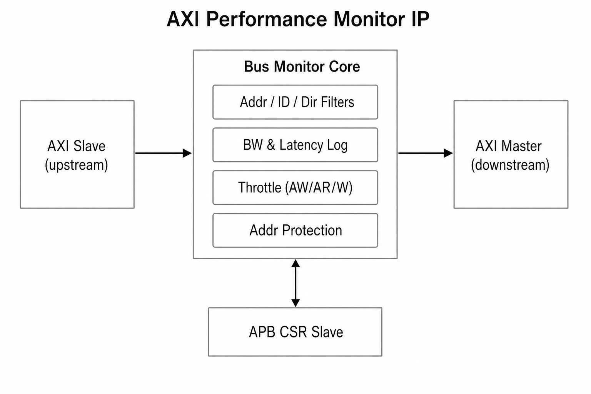
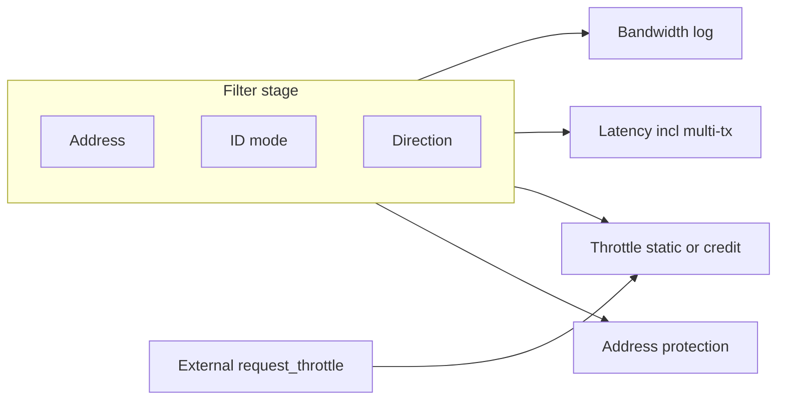

# AXI Performance Monitor IP — Design Request Specification

**Purpose**: This document defines the functional behavior, operating rules, and constraints for implementing an **AXI performance monitor with bandwidth control and address protection** in Verilog/SystemVerilog, for **first delivery** to the SoC IP team.  
**Audience**: SoC and IP design, verification, and software engineers (assumes first receipt of this IP).

**Scope**: This document is the **single normative baseline** for functional and behavioral requirements of this IP. **Register bitfields and addresses, pin/port lists, timing/electrical constraints, and SoC integration procedures** are documented in **companion material supplied by the IP provider**, which MUST remain **consistent** with this specification.

**Standalone delivery**: This package (Korean and English markdown plus the block-diagram image) is sufficient to convey the requirements; **no other repository markdown or internal documents need to be read.**

### Recommended delivery bundle

| File | Description |
|------|-------------|
| `request_for_design_busmon.md` | Korean specification (normative prose and tables). |
| `request_for_design_busmon_en.md` | English specification of the same content. |
| `busmon_architecture_overview.png` | §10 overview figure; keep **in the same folder** as the markdown (relative image link). |

You MAY generate Word/PDF from markdown. The Mermaid diagram in §10.2 may not render in all viewers; **§§4–9 and tables are normative.**

---

## 0. Notation: Mandatory vs Designer Discretion

| Term | Meaning |
|------|---------|
| **MUST** | Implement and verify as stated in this document. |
| **SHOULD** | Preferred practice; may be replaced if quality is equivalent or better. |
| **MAY** | Microarchitecture, implementation style, and detailed parameters are at designer discretion, provided **required behavior and AXI protocol compliance** are preserved. |

---

## 1. Design Goals (MUST)

- Deliver an **AXI performance monitor IP** suitable for production-quality use.
- **Bandwidth/latency logging**, **bandwidth throttling (multiple threshold modes)**, **external throttle control**, and **address protection** MUST be controllable and observable via registers within one IP.
- Provide pipeline and timing margin appropriate for high-frequency operation.

---

## 2. Interfaces (MUST)

### 2.1 AXI

1. **AXI Master Up / Master Down** (or Slave Up / Master Down naming **MAY** vary).  
   - Upstream and downstream use the **same data width** and **same clock**.  
2. Default data width is **256 bit** (other defaults **MAY** use parameters; 256 is the default).  
3. **Optional register slices** on Up and/or Down MUST be selectable via **parameters**.

### 2.2 Control / Status — APB

1. Control/status registers are accessed through an **APB 32-bit** slave interface.  
2. `pstrb` MAY be assumed **fixed to 0xF**.  
3. Same clock domain as the AXI master interface.

### 2.3 Interrupt

- **One interrupt output** (shared across logging events or masked into one line — sources and mask bits are defined in §8 and in the **companion register definition** for this IP).

### 2.4 Off-bus Input — External Throttle Control

**MUST**

- Provide a **2-bit** input port **`request_throttle[1:0]`** separate from AXI bus ports.  
- Define legal encodings as **0 through 3** (treatment of unused encodings is **MAY** — document as ignore or same as 0).  
- **SHOULD** operate in the **same clock domain** as AXI. If asynchronous, **MAY** add synchronizers; **MUST** consider metastability.

**MAY**

- Port naming and module-level pin prefixes.

---

## 3. Per-Feature Enable / Disable (MUST)

Control registers MUST provide **per-feature enable/disable** fields. Example split (field names and bit positions **MAY** vary):

- Bandwidth logging  
- Latency logging (single-tx / multi-tx latency via sub-enables or combined statistics in period — §5.2)  
- Bandwidth throttling  
- **External throttle control** (`request_throttle` path — §6.3)  
- Address protection  

**SHOULD** reduce unnecessary clock toggles when features are off.

---

## 4. Transaction Filters (MUST)

Used consistently for logging, latency measurement, and **throttle scope**. Filters are combined with **logical AND**: a transaction is included only if **all** of address, ID, and direction conditions match (when the relevant feature is enabled).

### 4.1 Address Filter

**MUST**

- Through control registers, allow monitoring only transactions in a **start address + size** (or start/end) range, or **full address space** tracking.

**MAY**

- Address compare implementation (alignment rules, upper-bit masks, etc.).

### 4.2 ID Filter

**MUST**

- Support these modes for **AXI ID** (ARID/AWID width per AXI parameters), selectable by register:  
  1. **Whitelist** — match one or more ID values (count and width upper bounds are **design parameters**).  
  2. **Blacklist** — exclude listed IDs.  
  3. **All IDs** (same effect as ID filter off).

**MAY**

- Number of whitelist/blacklist entries; mask/range vs exact match lists.

### 4.3 Direction Filter

**MUST**

- Register-selectable:  
  - **Read only**  
  - **Write only**  
  - **Read and Write**

**MAY**

- Whether “Write” covers AW only vs AW+W channels per AXI rules.

### 4.4 Applicability Summary (MUST)

| Feature | Filter combination |
|---------|-------------------|
| Bandwidth logging | Address + ID + DIRECTION |
| Latency logging (§5) | Same |
| Bandwidth throttling (§6) | Address + ID + DIRECTION (same combination as latency logging) |

---

## 5. Performance Logging

### 5.1 Bandwidth Logging

**Summary (MUST)**

1. **Period**: Select cycle count or transaction count (AW+AR handshake definition in register documentation). Repeats while enabled.  
2. **Measurement**: Derive bytes from `AxSIZE × burst length`, etc.; accumulate Write and Read separately; push to FIFO on period end.  
3. **FIFO**: Depth is a parameter; **Even/Odd** banks; switch storage bank every **N** periods (`N` < depth, set by control register).  
4. **Interrupt**: Optional level interrupt every N periods; mask via interrupt enable.  
5. **Status**: Current Even/Odd write target; which FIFO bank was written before the last interrupt.  
6. **Filters**: Count eligibility per §4.

**MAY**

- FIFO implementation (memory type), metadata fields.

---

### 5.2 Latency Logging

#### 5.2.1 Period and Average Storage

**MUST**

- Use the **same period registers** as bandwidth logging.  
- **Single-transaction** latency: store **per-period averages** only (sum / transaction count).  
- **Write latency**: cycles from completed AW handshake until first **B** acceptance.  
- **Read latency**:  
  - From AR until first **RVALID**  
  - From AR until last **RLAST & RVALID** (both statistics separately).  
- Even/Odd FIFO and N-period switching: same policy as bandwidth logging.

**MAY**

- Internal structures (e.g. per-ID queues) as appropriate for the implementation.

#### 5.2.2 Read / Write Multi-Transaction Latency

**Goal**: When outstanding transactions overlap, store **end-to-end delay of a “burst segment”** and **accumulated bytes** consistent with the Period/FIFO policy.

**MUST — Read multi-transaction latency**

1. **Segment start**: For a filtered Read, when **no outstanding Read** exists, start the latency counter when **ARVALID & ARREADY** complete.  
2. **Segment end**: For the **last Read transaction** of that segment, stop when **RLAST & RVALID & RREADY** complete.  
3. **Storage**: On completion (or per §5.2.3 at period boundaries), store **byte count** and **period (cycle count)** per the chosen storage mode (FIFO / average, etc.) using the same **Even/Odd FIFO scheme** as §5.1 and §5.2.1.  
4. If **outstanding Reads already exist** when a new Read starts: **do not reset** the multi-transaction latency counter; **only add bytes** (same segment).

**MUST — Write multi-transaction latency**

- Same policy as Read. **Segment start**: first valid request when no outstanding Write (typically **AW** or first valid per protocol). **Segment end**: **BVALID & BREADY** for the last Write of the segment.  
- Additional Writes in the segment add bytes **without resetting** the counter.

**MAY**

- Byte accounting for Write multi segments (AW-only vs AW+W data) — must stay **consistent** with document-wide byte definitions.  
- Whether multi-transaction stats go into period **averages** or **per-sample FIFO** — specify in register map.

#### 5.2.3 Multi-Transaction Statistics vs Period (MUST / partial MAY)

**MUST**

- Single- and multi-transaction latency stats include only transactions passing **§4 filters**.  
- **MAY** share the same period timebase as bandwidth/latency logging.

**MAY**

- If multiple multi-transaction segments complete in one period, whether to store **average, sum, or max** — define in register map.

---

## 6. Bandwidth Throttling

### 6.1 Common

**MUST**

- Provide a throttle period register separate from logging period (`period_throttle`, naming **MAY** vary).  
- Byte accounting for throttling uses the **same byte rules** as logging.  
- **Scope**: Throttling applies only to transactions satisfying §4 **address + ID + DIRECTION**.  
- Insert delay to limit bandwidth.

**MAY**

- Sliding vs fixed aggregation windows.

---

### 6.2 Threshold Mode Options (MUST)

Selectable **dynamically** by register.

#### 6.2.1 Static Threshold

**MUST**

- Each `period_throttle` window, if accumulated bytes exceed the configured **threshold**, insert delay on AW/AR (and §6.4) **acceptance timing** to reduce bandwidth.  
- **Different delay values** may be set for AW vs AR.

#### 6.2.2 Credit-Based Threshold

**MUST — Concepts**

- **credit_period**: Independent of logging/static throttle period; register-programmable.  
- Each **credit_period**, add **number_of_credit** (register) to the **accumulated** credit pool.  
- **Clamp** accumulation to a **maximum** (register or parameter).  
- On **transaction request acceptance** (**VALID & READY** on that channel — document per channel).  
- Debit amount = **request bytes** right-shifted by **credit_divider**, i.e. integer result of **bytes / 2^credit_divider** (floor division; *bytes* = transaction byte count).  
- **Never** let debit drive balance **below zero** (insufficient credit → §6.2.3).  
- **Separate** credit pools for **Read** and **Write**.

**MAY**

- Credit counter width; ordering when multiple transactions debit in one cycle.

#### 6.2.3 Insufficient Credit — Delay (MUST)

**MUST**

- If credit is insufficient, **delay acceptance** to limit bandwidth.  
- Apply **independently** to Read and Write paths (matching separate credits).

---

### 6.3 External Throttle Control

Receive throttle intent on **pins** separate from AXI, and apply insertion delay on the **request path** using **delay registers independent** of §6.2 and §6.4.

#### 6.3.1 Input Semantics (MUST)

**MUST**

- Port **`request_throttle[1:0]`** (§2.4).  
- **`request_throttle == 0`**: No **additional** delay from this input (even if feature enabled).  
- **`request_throttle == 1`, `2`, `3`**: Each selects a **different delay** on the **request acceptance** path. Delays are **register-programmable** and **MUST** use registers **separate** from AW/AR/W delay and credit settings in §6.2 and §6.4 — e.g. **three dedicated registers** (or equivalent) for encodings 1–3.  
- **Enable/disable** of this feature **MUST** be dynamically programmable via APB. When disabled, `request_throttle` **MAY** be ignored (**SHOULD** document).

**MAY**

- Scope of “request signals”: typically AR/AW address-phase acceptance; extending to W/R response channels is **MAY** — **document** in register map.  
- Three separate registers vs encoded table for delays 1–3.

#### 6.3.2 Interaction with Internal Bandwidth Throttling (MUST / MAY)

**MUST**

- When external throttle and §6.2 internal throttling are **both** active, combined delay **MUST** preserve AXI **protocol** and avoid **deadlock**.

**MAY**

- Rules for **sum, max, priority** — document in register map / implementation.

#### 6.3.3 Scope (MAY)

- Whether §4 filters also gate external throttle is **MAY**; optional register to select scope is **MAY**. Implementations that apply external throttle **globally** (all transactions) are allowed.

---

### 6.4 Write Path — WREADY Delay

**MUST**

- Support additional **WREADY** delay as part of throttling write data.  
- Delay magnitude **MUST** be a **separate register**.  
- Interaction with Static/Credit (e.g. WREADY delay only when credit-starved) **MUST** be documented in the register map; **MUST** comply with AXI **W channel** rules.

**MAY**

- Priority and combining rules between AW delay and W delay.

---

### 6.5 Mode Select and Registers (MUST)

**MUST**

- Select **one** of §6.2.1 or §6.2.2 at run time.  
- Unused fields **MAY** be ignored when inactive (**SHOULD** document).

---

## 7. Address Protection

**MAY** be enabled **independently** of bandwidth throttle and latency log.

### 7.1 Protected Regions

**MUST**

- Define allowed regions as **(base address, end address)** pairs; maximum number of pairs is a **design parameter**.  
- Each pair **MAY** be dynamically **valid**-gated.  
- If a transaction address falls in **no** active pair, treat as **protection violation** (compare ARADDR/AWADDR; details **MAY**).

### 7.2 Graceful Ignore Behavior

**MUST — Read**

- Log **AXID** and **ARADDR** to **error log registers**.  
- Complete handshakes **without breaking AXI timing** upstream or downstream.  
- How illegal accesses are blocked from the downstream slave (e.g. no AR downstream + local error response) is **MAY**; **no deadlock** and **VALID/READY compliance** are **MUST**.

**MUST — Write**

- Log sufficient fields (**AWADDR**, **AWID** recommended).  
- On the downstream write path, drive **WSTRB = 0** for all bytes (**MAY** align/pack cycles; **MUST** keep protocol legal).

### 7.3 Error Log Register Format (MUST)

Each error source (or shared register) **MUST** include:

- **valid**: Error pending.  
- **multi**: Encodes:  
  - `valid=1`, `multi=0`: **one** occurrence.  
  - `valid=1`, `multi=N` (N>0): **N** occurrences (saturate at **multi** width; **MAY** add overflow flag — document).

**MUST**

- Clear error logs via **write-one-to-clear (W1C)** through the IP’s **APB CSR slave**.

**MAY**

- Separate vs merged registers for Read/Write errors.

---

## 8. Interrupt and Status (summary)

- **One** interrupt line.  
- **MAY** mask logging FIFO events, address-protection errors, etc., provided software can still distinguish events.

---

## 9. Verification (MUST)

- Sufficient **assertions (SVA, etc.)** for AXI protocol and counter boundary conditions in this document.

---

## 10. Structural Overview

### 10.1 Block Diagram

### 10.2 Filters → Features (reference Mermaid)

---

## 11. Implementation Deliverables (SHOULD)

The IP provider **SHOULD** supply, together with the implementation (directory layout **MAY** vary):

- **RTL sources**: Verilog/SystemVerilog suitable for synthesis and simulation.  
- **User documentation**: **Control register descriptions** (bit meanings, addresses, reset values) consistent with this specification, plus clock/reset and parameter descriptions.  
- **Verification collateral**: SVA assertions, test plan or verification summary.

---

## Appendix A. Terms, Abbreviations, and AXI Channels

This appendix **summarizes** concepts for readability; protocol details follow **AMBA AXI**.

| Term | Description |
|------|-------------|
| **Upstream / Downstream** | Relative to traffic flow through the monitor; connects to upstream masters/slaves on one side and downstream on the other (matches “Master Up / Master Down” naming in §2). |
| **AR / AW / R / W / B** | Read address, Write address, Read data, Write data, Write response channels. |
| **Outstanding** | A transaction whose response is not yet complete while subsequent address/data phases may be in flight; used in §5.2.2 multi-transaction segments. |
| **APB** | Low-speed configuration bus; this IP assumes a **32-bit APB slave** for CSR access. |
| **CSR** | Control/status registers for configuration, statistics, and error logs. |
| **Even/Odd FIFO** | Two storage banks alternated every N periods so software can read one bank while the other continues recording. |
| **W1C** | Write 1 to Clear; writing 1 to a bit clears a flag. |
| **SVA** | SystemVerilog Assertions. |

**Byte counting**: Phrases such as “AxSIZE × burst length” refer to **transaction byte volume** derived from AXI **AWSIZE/ARSIZE** and **AWLEN/ARLEN** (and related rules); the exact formula SHOULD match the AXI standard and be stated in the register/user documentation.

---

**Companion documentation**: Register maps, pin lists, and timing are provided separately by the IP provider and MUST satisfy the functional requirements of this specification.
